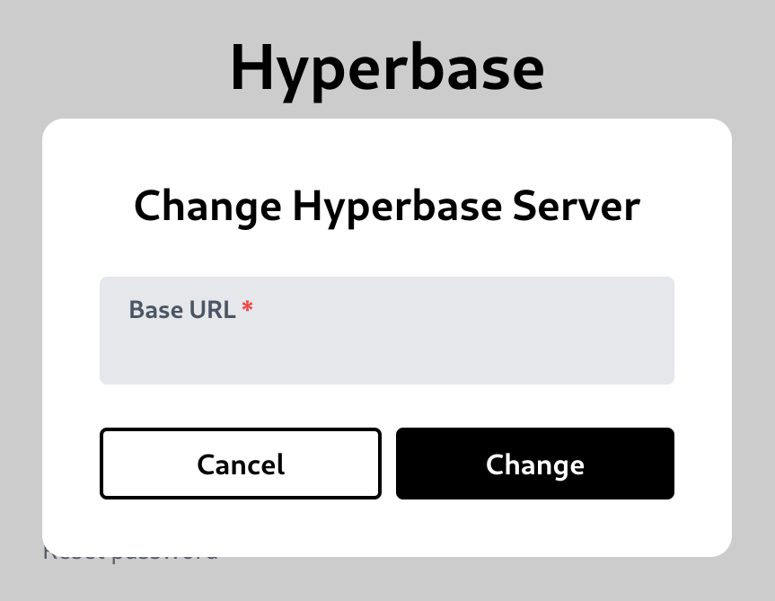

# Quick Start (using Hyperbase UI)

This section will show how to configure a project in Hyperbase using Hyperbase UI.

If you open the UI for the first time, you will be asked about the base url of Hyperbase server.\
\
An example value is [https://api.hyperbase.in](https://api.hyperbase.in)
