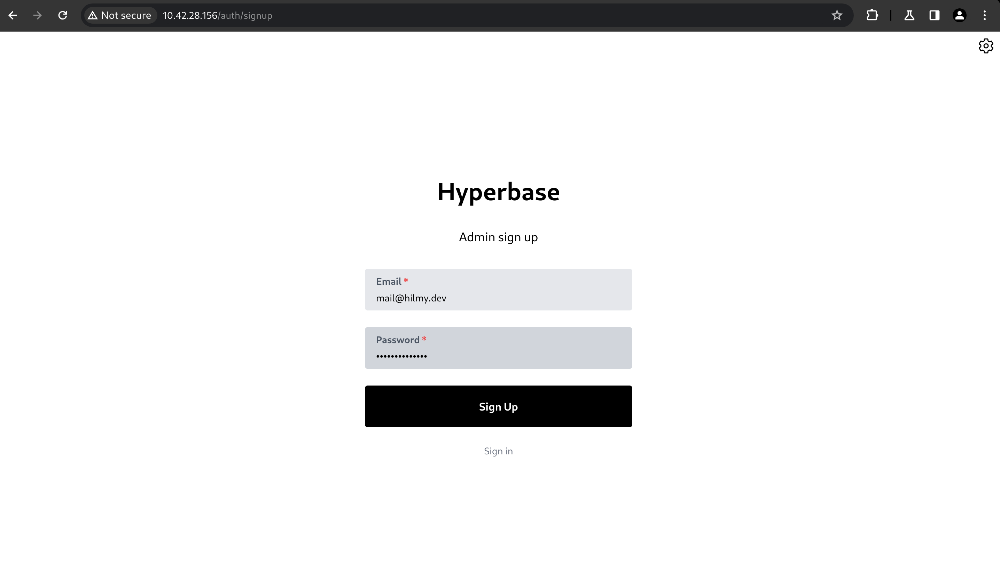
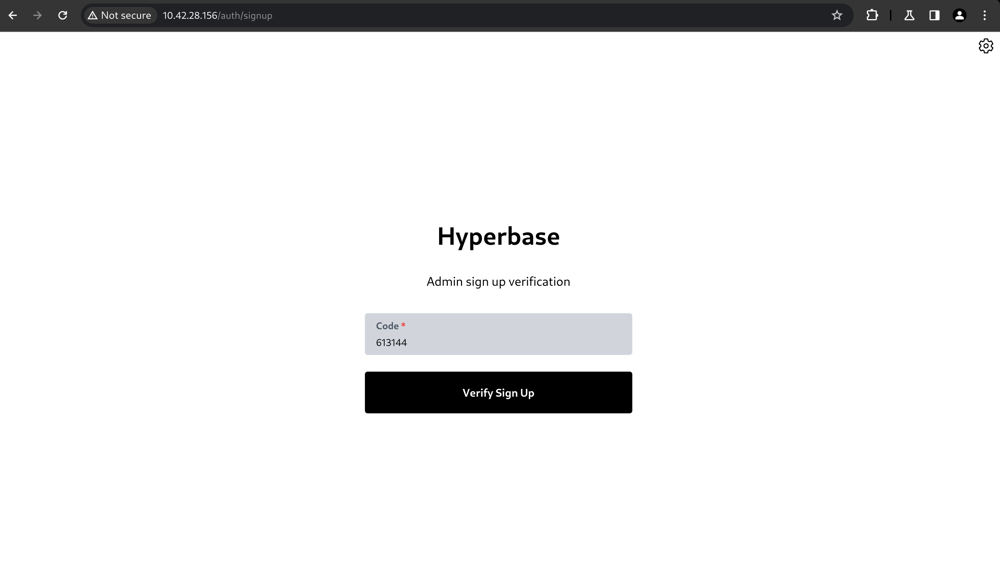
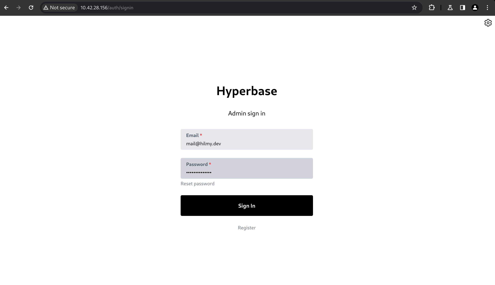

# Sign Up

You need to create an admin account before using Hyperbase. Follow the steps bellow to create the account.

- Open Hyperbase UI. On the sign in page, click Register. Make sure to enable `admin_registration` in [the configuration file](../03_installation/04_setup/04_hyperbase.md#configuration-file).

- Fill up the email and password, then click Sign Up.\
  

- Check your email inbox. Copy the verification code, then click Verify Sign Up.\
  

- If your verification code is correct, you will be redirected to the sign in page.\
  
