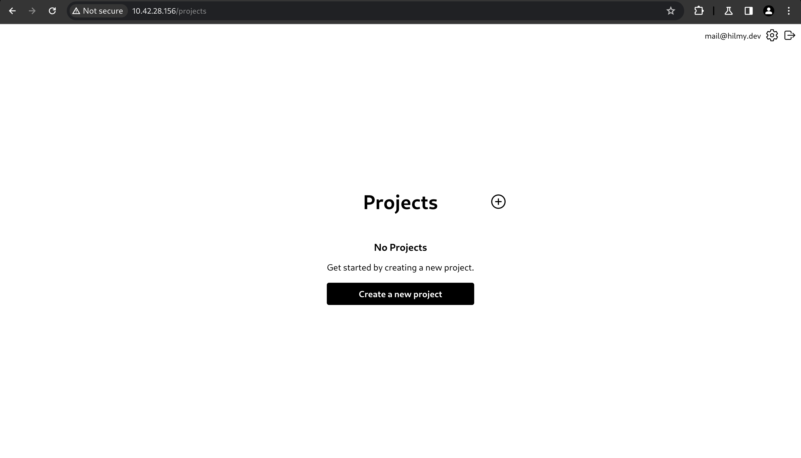
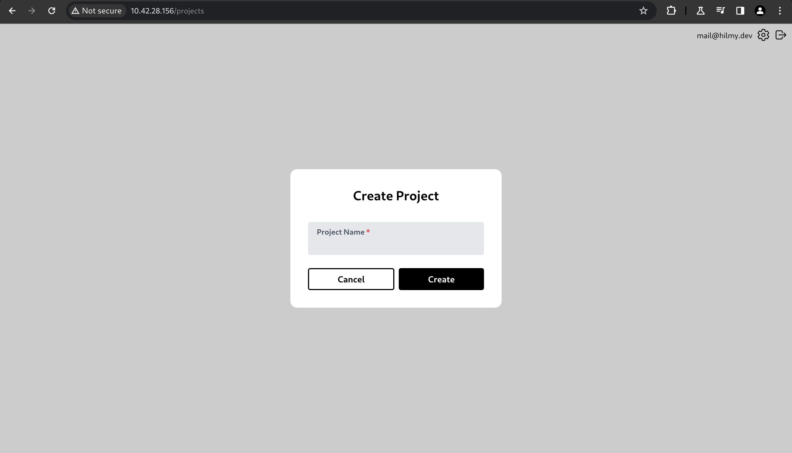
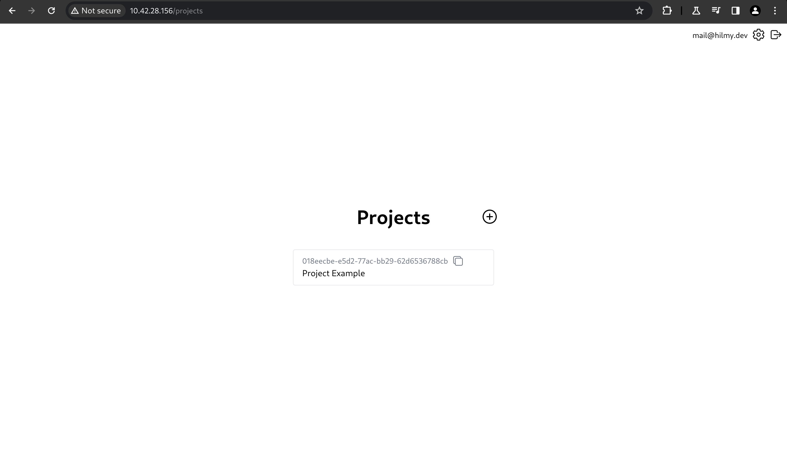

# Create Project

- To create new project, click Create a new project.\
  

- Fill in the Project Name field, then click Create.\
  

- Click the newly created project.\
  

> **NOTE**: You can create unlimited projects, depending on your needs and server storage.
