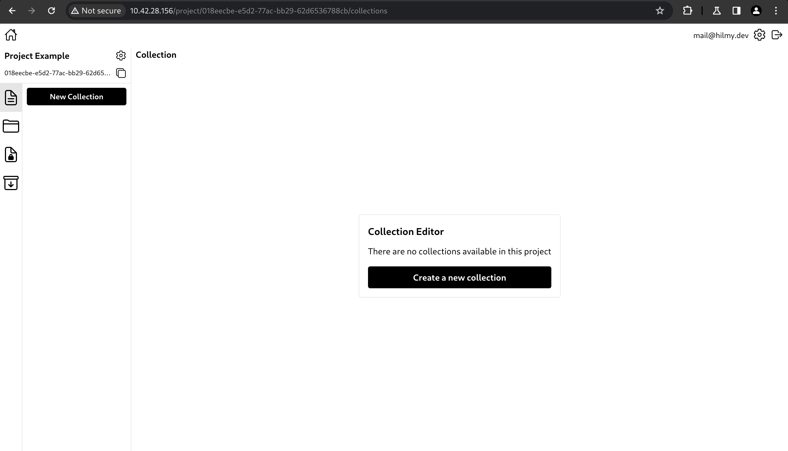
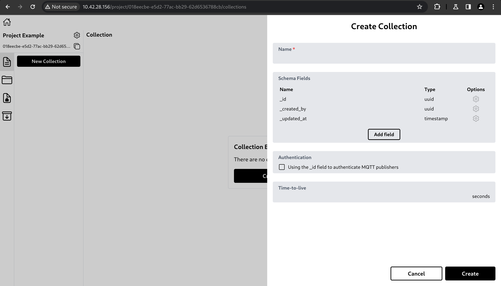
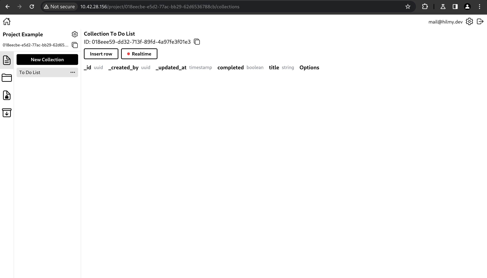

# Create Collection

If you want to store data, you need to create a collection. Collection is a container for storing data so that the data is grouped.

In Hyperbase, collections are schema-based databases, meaning that data inserted to the collection must conform to its schema. Parts of the data that are not in the schema will be ignored and parts of the data that are in the schema but not in the data will be treated as `null`.

- To create a collection, click New Collection or Create a new collection.\
  

- A side panel with a form will appear.\
  \
  The form has the fields below.
  - Name: Collection name.
  - Schema field: The structure of the data to be stored.
  - Authentication using \_id: Uses the \_id field to authenticate MQTT publishers (uses auth token with user field).
  - Time-to-live: The duration before the data is considered expired. Once the duration has passed, the data will be deleted.

- After clicking Create, the collection will be created.\
  
