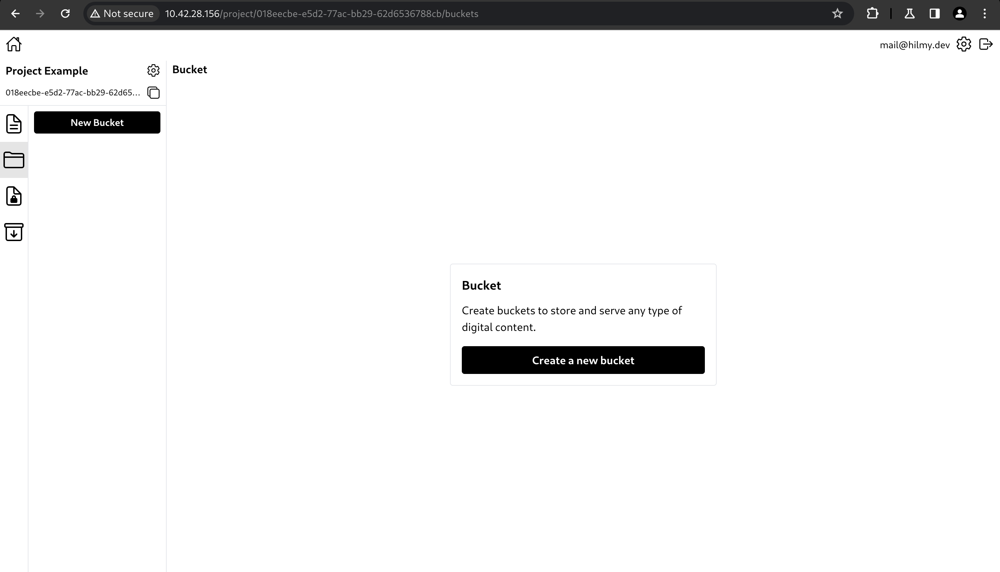
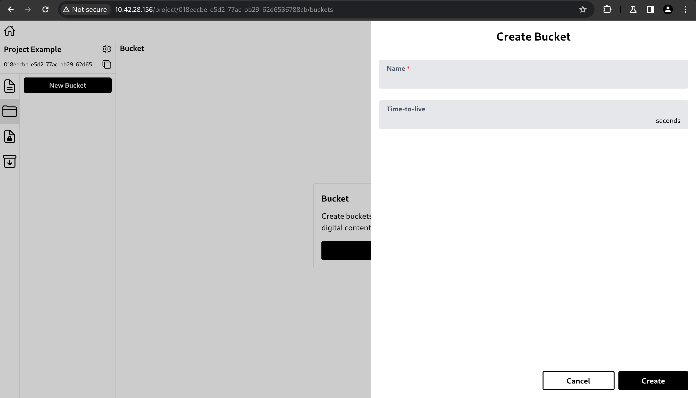
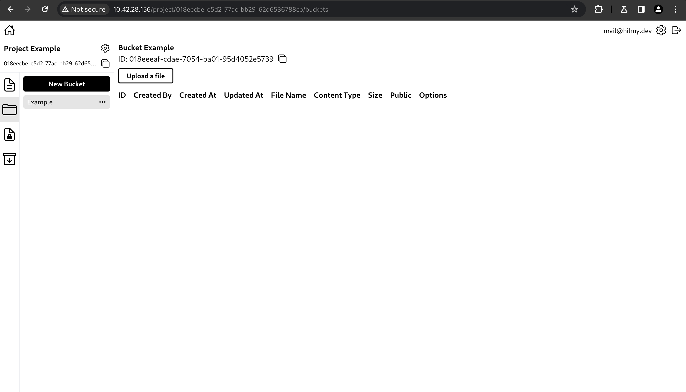

# Create Bucket

Buckets are like a collections for files. Buckets are used to store files and group them. Unlike collections, buckets have no restrictions on file types or sizes. Size limitations may be applied due to server capabilities or the network conditions.

- To create a bucket, click New Bucket or Create a new bucket.\
  

- A side panel with a form will appear.\
  \
  The form has the fields below.
  - Name: Bucket name.
  - Time-to-live: The duration before the file is considered expired. Once the duration has passed, the file will be deleted.

- After clicking Create, the bucket will be created.\
  
