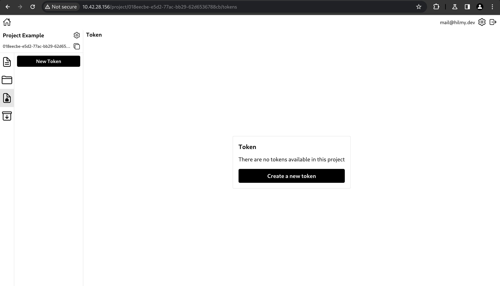
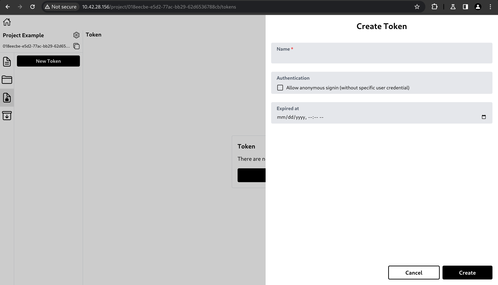
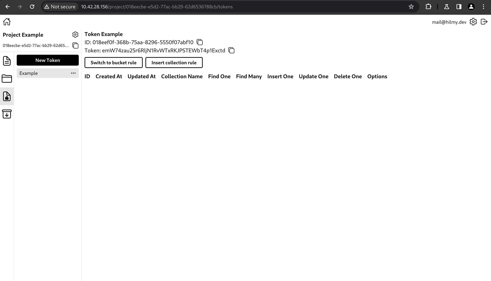
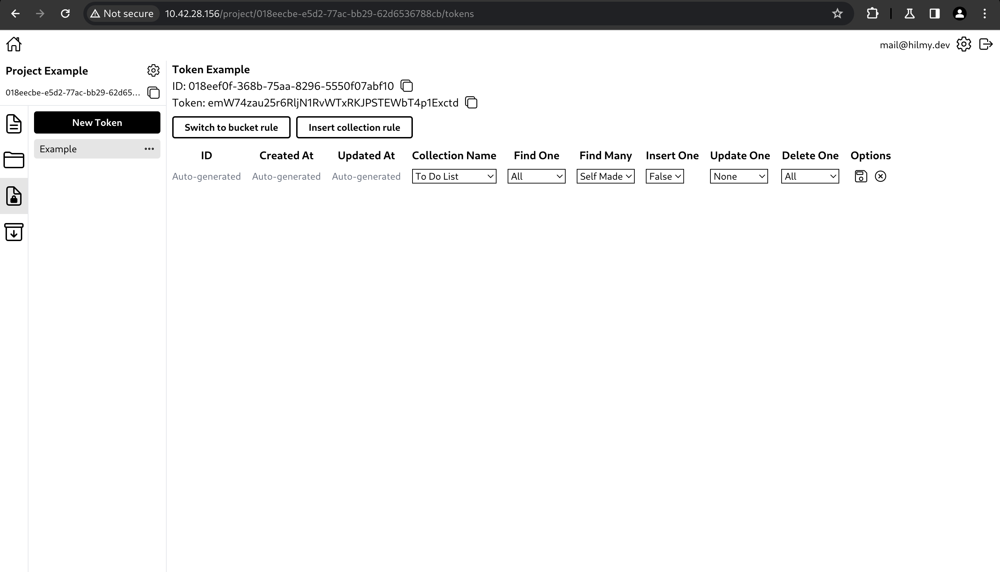

# Create Access Token

Access tokens are used by app users to access and/or manipulate data in Hyperbase. This will enforce security rules to control the access of app users so that data can only be accessed and manipulated by those who are authorized.

- To create an access token, click 'New Token' or Create a new token.\
  

- A side panel with a form will appear.\
  \
  The form has the fields below.

  - Name: Access token name.
  - Anonymous authentication: Allow app user to sign in without an account (just send this token, without specifying their account credentials).
  - Expired at: The time this token will expire. Once expired, this token can no longer can be used to authenticate app user, unless the expired at value is removed or changed to a future time.

- After clicking Create, the access token will be created.\
  

You need to configure the access controls of each collection and bucket before app users can access and/or manipulate them. Follow the steps below to configure one of them.

- Click Insert collection rule, a editable row will appear. After configuring the access control, click save icon. After that, you can use this token to access and/or manipulate this collection based on these rules.\
  \
  - All: All app users have permission to perform the specified rule.
  - Self Made: Only app users who created the data have permission to perform the specified rule.
  - None: All app users do not have permission to perform the specified rule.
  - True: App users have permission to perform the specified rule.
  - False: App users do not have permission to perform the specified rule.

You can make other collection rules or bucket rules in the similar way.
