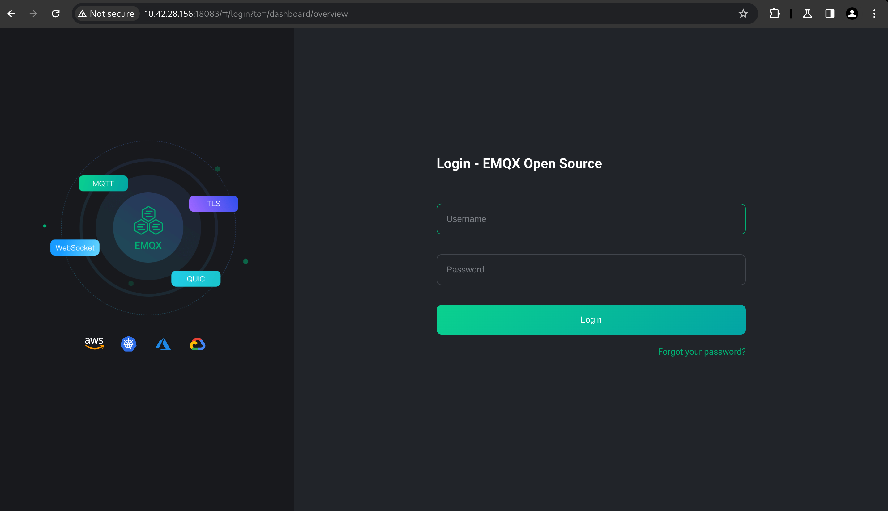
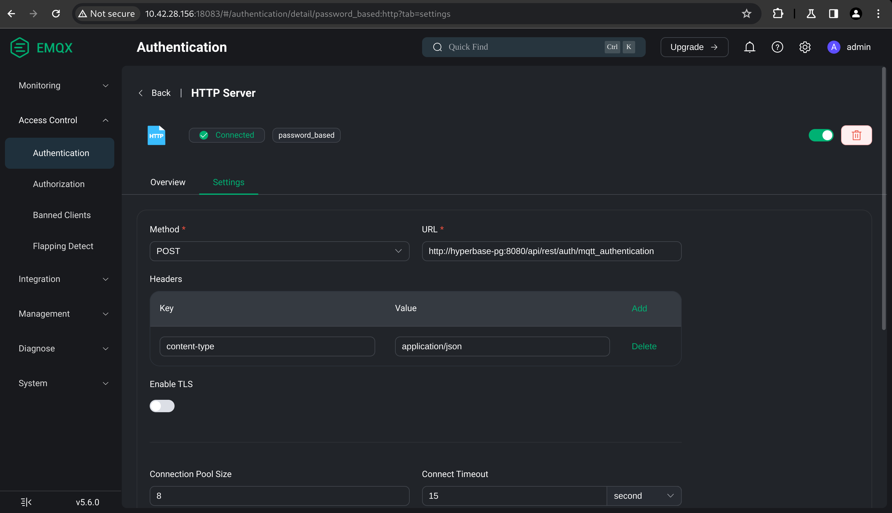
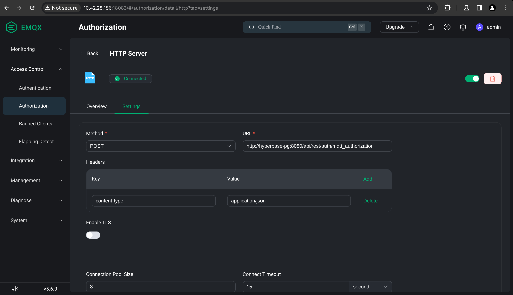
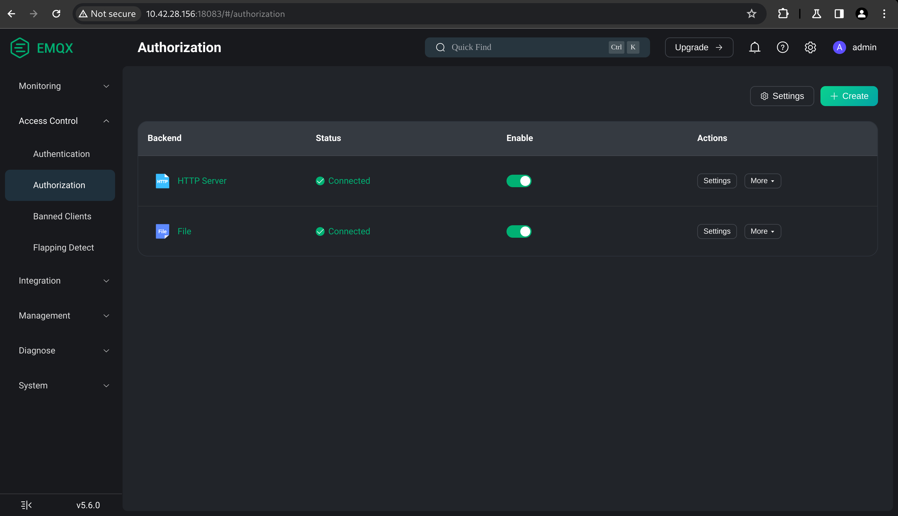

# Post-installation

After setting up Hyperbase installation, you can continue to this section.

## Configure MQTT (EMQX) security

Hyperbase will subscribe to certain topic specified in the [configuration file](04_setup/04_hyperbase.md). Publishers may send sensitive data that should not publicly available. Following the steps below will ensure that the publishers and subscribers will need a `username` and `password` to connect to the MQTT broker and the specified topic cannot be subscribed to by other than Hyperbase itself.

- Open EMQX dashboard.\
  

- Go to Access Control/Authentication page, then click Create.
  Create an authentication mechanism with the following properties.
  - Mechanism: Password-Based
  - Backend: HTTP Server
  - Configuration:
    - Method: POST
    - URL: {{YOUR_HYPERBASE_ADDRESS}}/api/rest/auth/mqtt_authentication
    - Headers:
      - content-type: application/json
    - Enable TLS: {{DEPEND_ON_YOUR_SETUP}}
    - Body:
      ```json
      {
        "username": "${username}",
        "password": "${password}"
      }
      ```\
  

- Go to Access Control/Authorization page, then click Create.
  Create an authorization mechanism with the following properties.
  - Backend: HTTP Server
  - Configuration:
    - Method: POST
    - URL: {{YOUR_HYPERBASE_ADDRESS}}/api/rest/auth/mqtt_authorization
    - Headers:
      - content-type: application/json
    - Enable TLS: {{DEPEND_ON_YOUR_SETUP}}
    - Body:
      ```json
      {
        "action": "${action}",
        "topic": "${topic}",
        "username": "${username}"
      }
      ```\
  

- Ensure that the newly created authentication and authorization mechanisms have a **Connected** status and placed at the top of the list.\
  