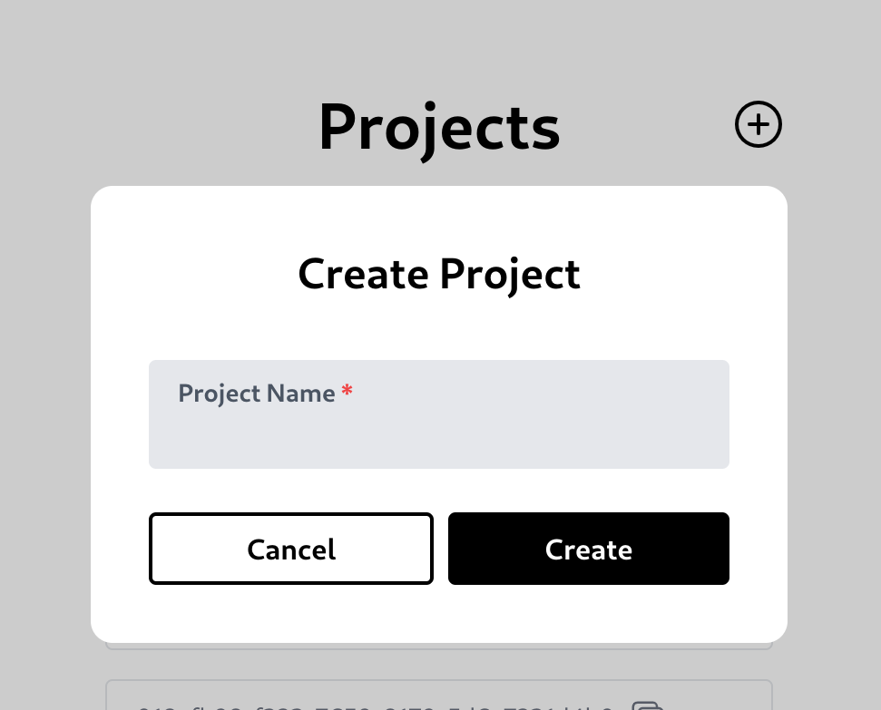
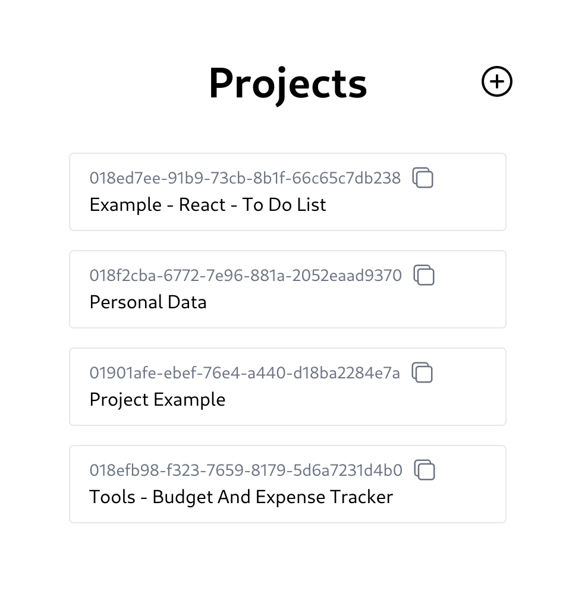
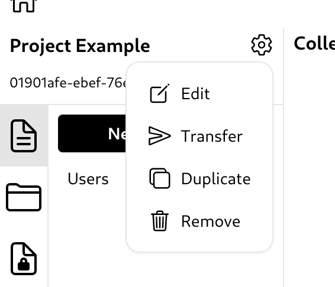
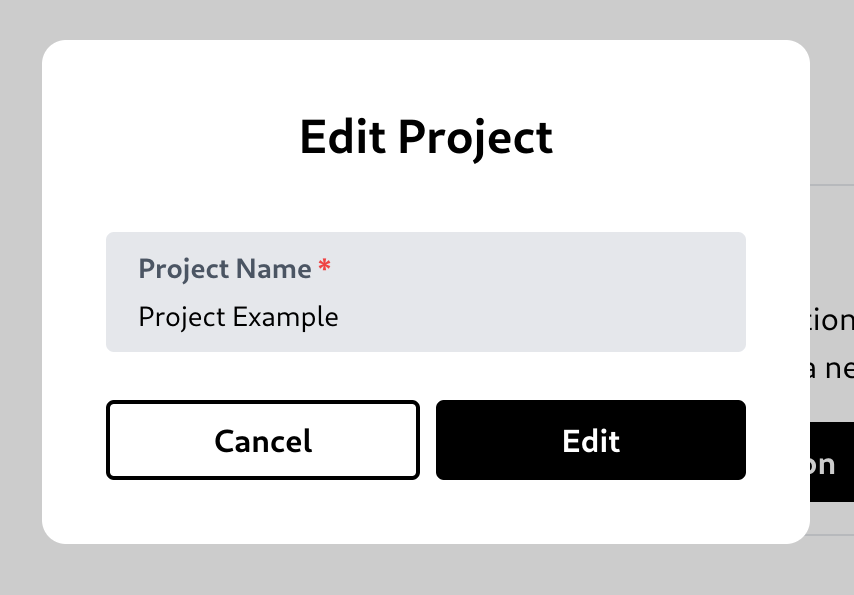
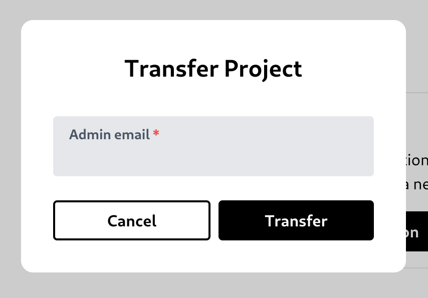
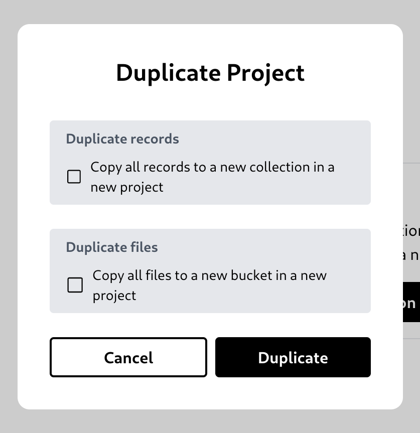
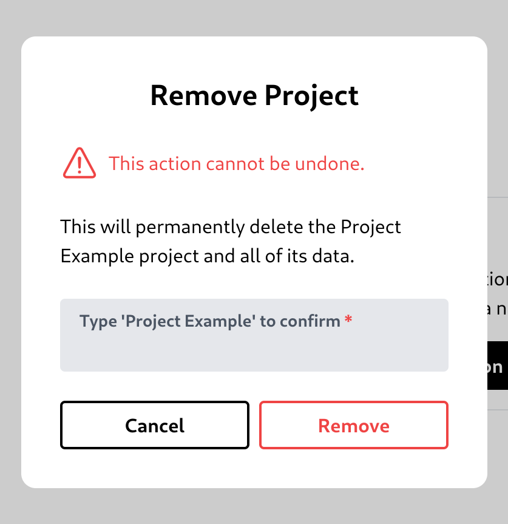

# Project

## Create a project

To create a project, click the circular bordered plus button in the projects page.\

## List of projects

## Project option

You can edit the project name, transfer the project to another user, duplicate the project, or remove it.\

## Edit a project

## Transfer a project

## Duplicate a project

You can choose to also copy the data or not.\

## Remove a project

