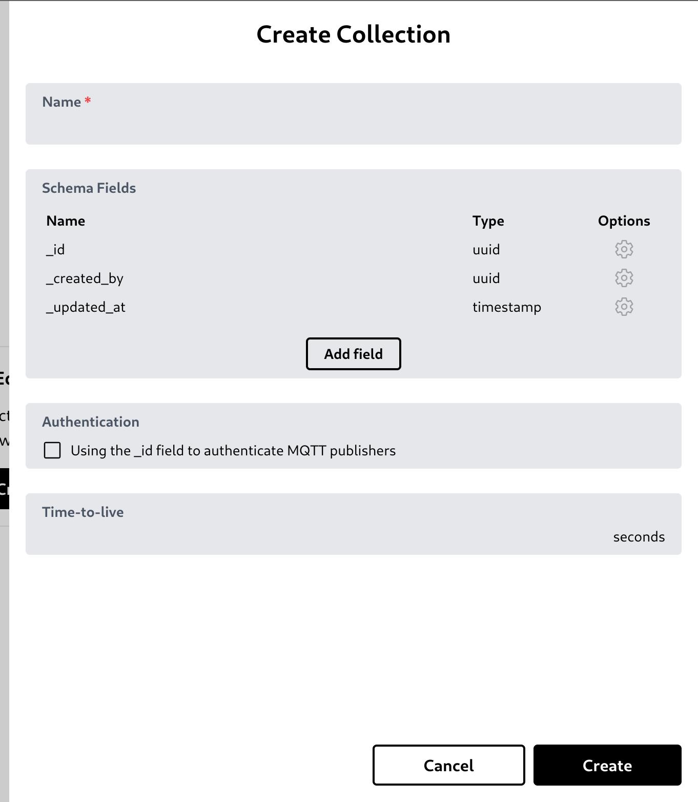
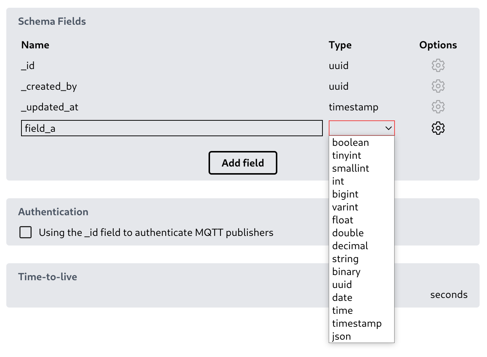
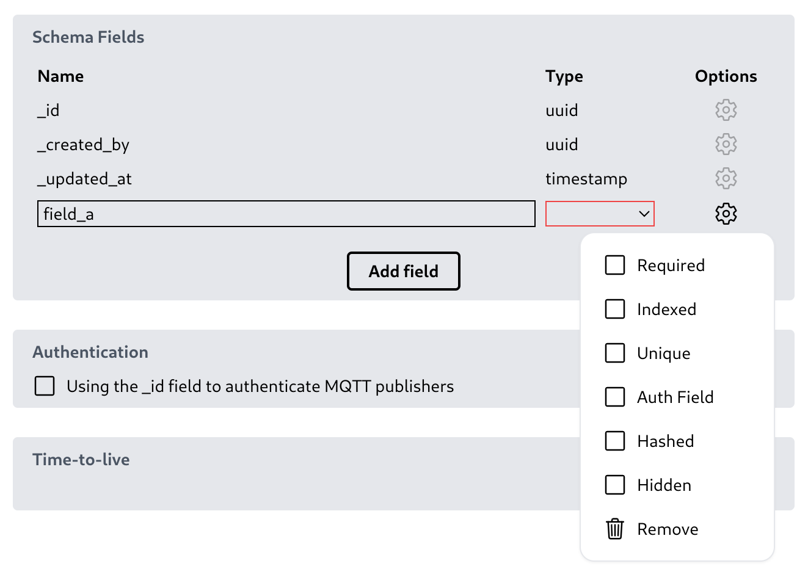
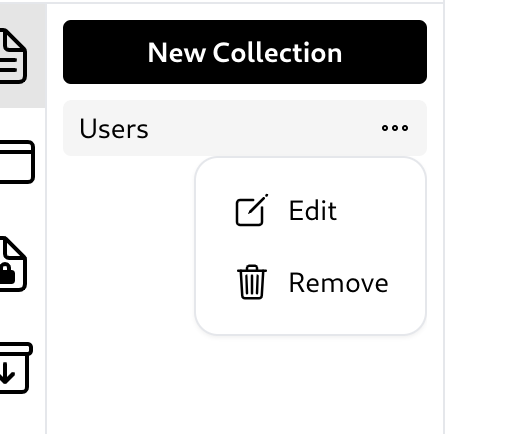

# Collection

## Create a collection

You can create a collection by clicking 'New Collection' button.\
\
It will open a create collection modal. You can type the collection name, specify the collection schema, choose to allow MQTT publisher client to authenticate using '\_id' field on this collection, and a time-to-live (TTL) to set data expiration time.\
\
In the schema fields section, you can set the field type and options. [More about this collection schema is in the next section](05_collection_schema.md).\
\

## Edit or remove a collection

To edit or delete a collection, simply click the three-dot button and the options to edit or delete the collection will appear.\

