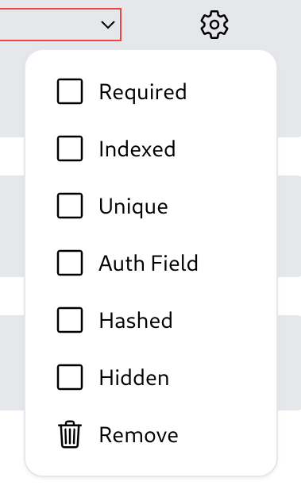

# Collection Schema

Hyperbase is implementing schema-based database. This will ensure that the data to be inserted has the correct field, type, and comply with some rules based on the options applied.

## Data Types

Hyperbase supports multiple data types. The data types defined on the schema are then converted to the native types supported by the database used by Hyperbase. Below is the data type equivalence table.

| Hyperbase | ScyllaDB  | PostgreSQL       | MySQL        | SQLite    | Rust Type                      |
| --------- | --------- | ---------------- | ------------ | --------- | ------------------------------ |
| Boolean   | Boolean   | Bool             | Bool         | Boolean   | bool                           |
| Tinyint   | Tinyint   | Char             | Tinyint      | Integer   | i8                             |
| Smallint  | Smallint  | Smallint         | Smallint     | Integer   | i16                            |
| Int       | Int       | Integer          | Int          | Integer   | i32                            |
| Bigint    | Bigint    | Bigint           | Bigint       | Bigint    | i64                            |
| Varint    | Varint    | Numeric          | Blob         | Blob      | BigInt (crate: num_bigint)     |
| Float     | Float     | Real             | Float        | Real      | f32                            |
| Double    | Double    | Double Precision | Double       | Real      | f64                            |
| Decimal   | Decimal   | Numeric          | Blob         | Blob      | BigDecimal (crate: bigdecimal) |
| String    | Text      | Varchar          | Varchar(255) | Text      | String                         |
| Binary    | Blob      | Bytea            | Blob         | Blob      | Vec<u8>                        |
| UUID      | UUID      | UUID             | Binary(16)   | Blob      | Uuid (crate: uuid)             |
| Date      | Date      | Date             | Date         | Date      | NaiveDate (crate: chrono)      |
| Time      | Time      | Time             | Time         | Time      | NaiveTime (crate: chrono)      |
| Timestamp | Timestamp | Timestamptz(6)   | Timestamp(6) | Timestamp | DateTime<Utc> (crate: chrono)  |
| JSON      | Blob      | Jsonb            | Json         | Blob      | String                         |

## Field Options

Hyperbase also supports many options to apply to fields. Below is an explanation of those options.\

- Required\
  Data in that field must be not null.
- Indexed\
  Field is indexed in the database.
- Unique\
  Enforce uniqueness for a field within a collection. This means that no two data in the collection can have the same values in the field.
- Auth Field\
  This option marks the field that will be allowed to be used as authentication fields in token-based signin.
- Hashed\
  This option marks the field so that its value will be hashed when inserting and updating data.
- Hidden\
  This option marks the field so that its value will never be sent to users with non-admin credentials.
