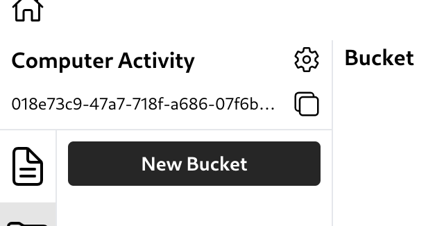
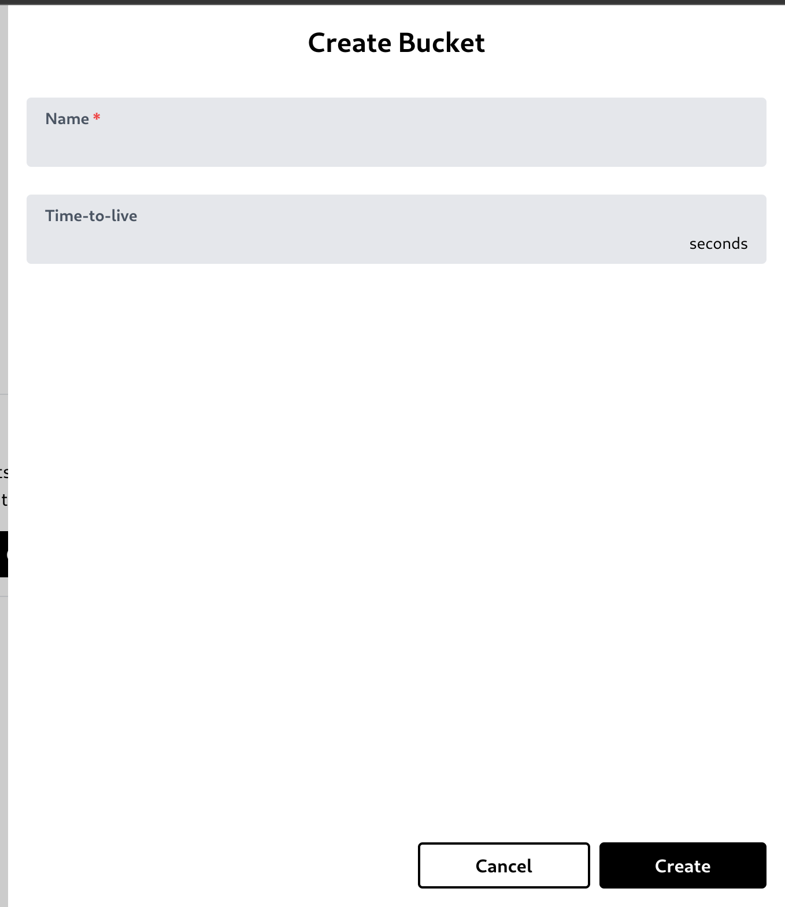
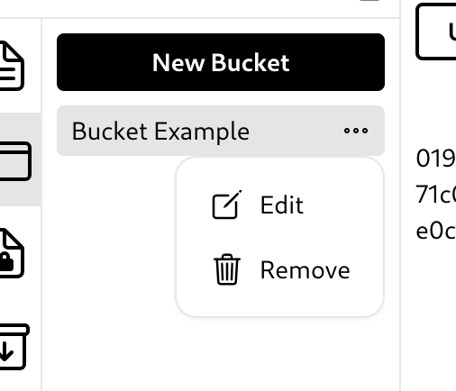

# Bucket

## Create a bucket

You can create a bucket by clicking 'New Bucket' button.\
\
It will open a create bucket modal. You can type the bucket name and specify a time-to-live (TTL) to set file expiration time.\

## Edit or remove a bucket

To edit or delete a bucket, simply click the three-dot button and the options to edit or delete the bucket will appear.\
