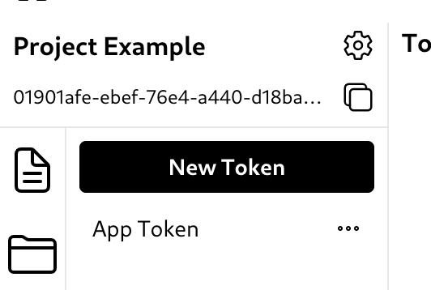
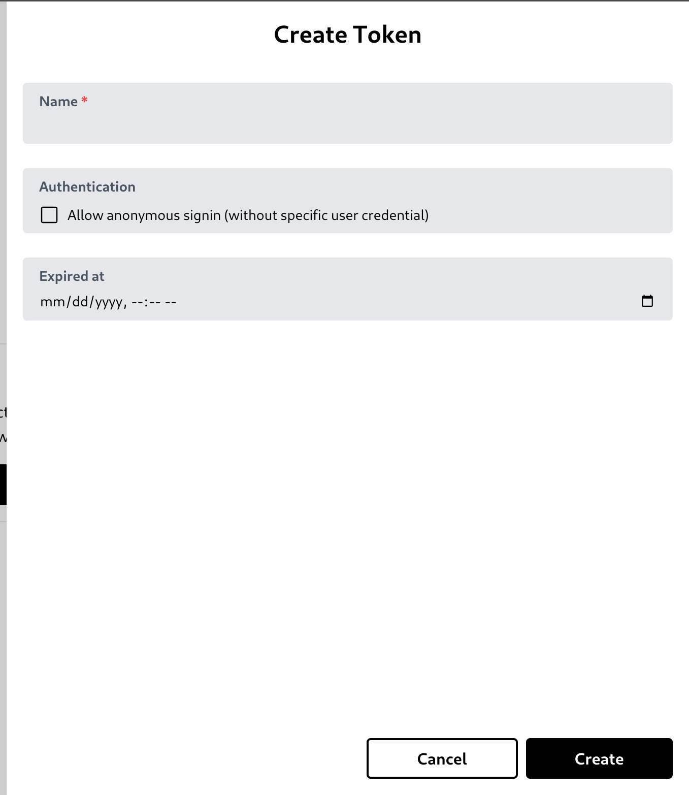
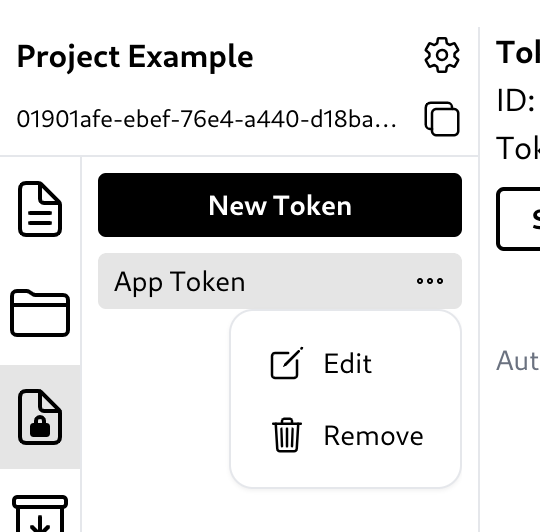

# Token

Tokens can be used for signin using token-based signin. Tokens can have a set of rules to allow or disallow access or manipulation of data in a particular collection or bucket. Tokens should be used by application users to limit their capabilities when interacting with Hyperbase.

## Create a token

You can create a token by clicking 'New Token' button.\
\
It will open a create token modal. You can type the token name, allow or disallow anonymous signin, or specify its expiration time.\
\
Disallowing anonymous login will ensure the user credentials sent in the login request exactly match a single record with [the auth field value specified in the collection option](05_collection_schema.md#field-options).

# Edit or remove a token

To edit or delete a token, simply click the three-dot button and the options to edit or delete the token will appear.\

