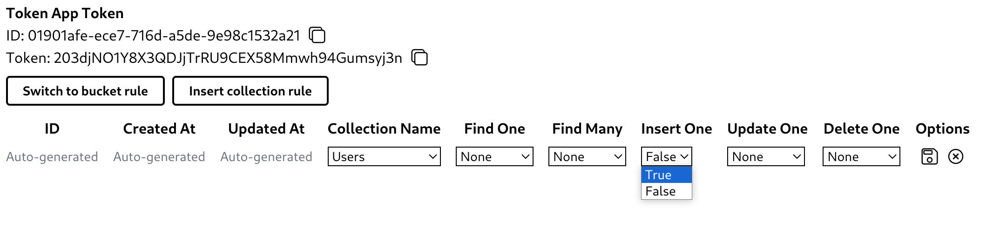

# Token Rules

Token rules are set of rules that manage user access rights. You can insert, update, or delete collection rules or bucket rules.\

Find One, Find Many, Update One, and Delete One rules have three options as below.

- All: All signed-in users.
- Self Made: Only user who has created the data, except admin users.
- None: No users, except admin users.

Insert One rule has two options, true or false. True means the signed-in user can insert data to the collection or bucket.
