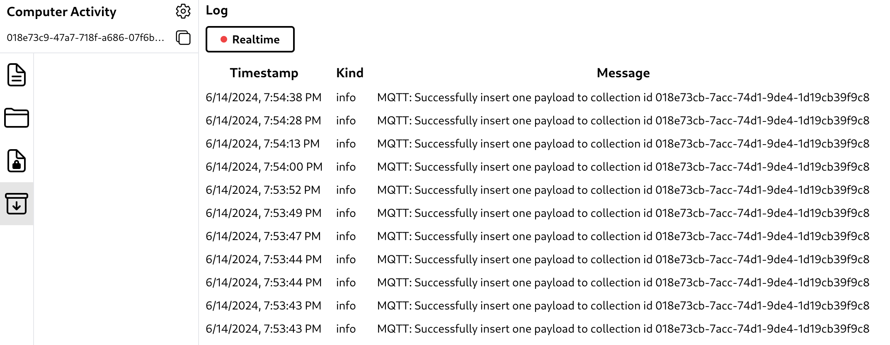

# MQTT Log

Finding errors in systems that use the MQTT protocol can be difficult because publishers can successfully publish messages to the MQTT broker but the messages fail to be processed at the subscriber. To overcome this, Hyperbase also provides logs so that admins can monitor errors and the success of data manipulation using the MQTT protocol.

