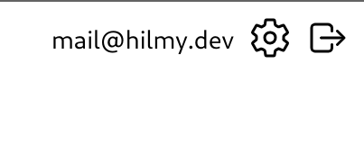
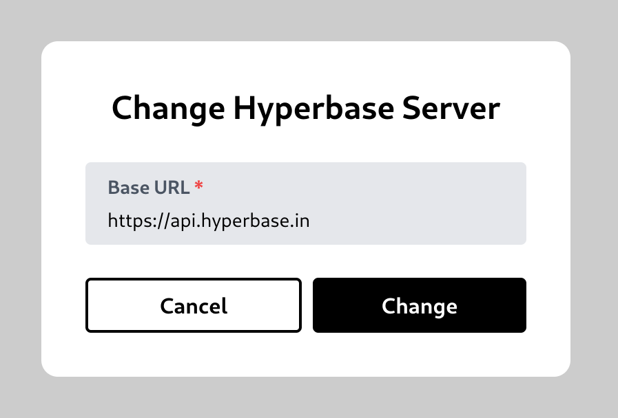

# Change Server

While using the Hyperbase UI, you can change the URL of your Hyperbase server by clicking the gear symbol button on the top right corner.\
\
This will bring up the Change Hyperbase Server modal.\
