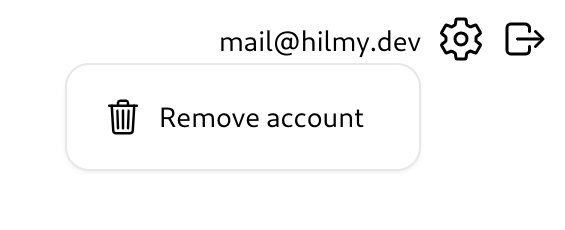
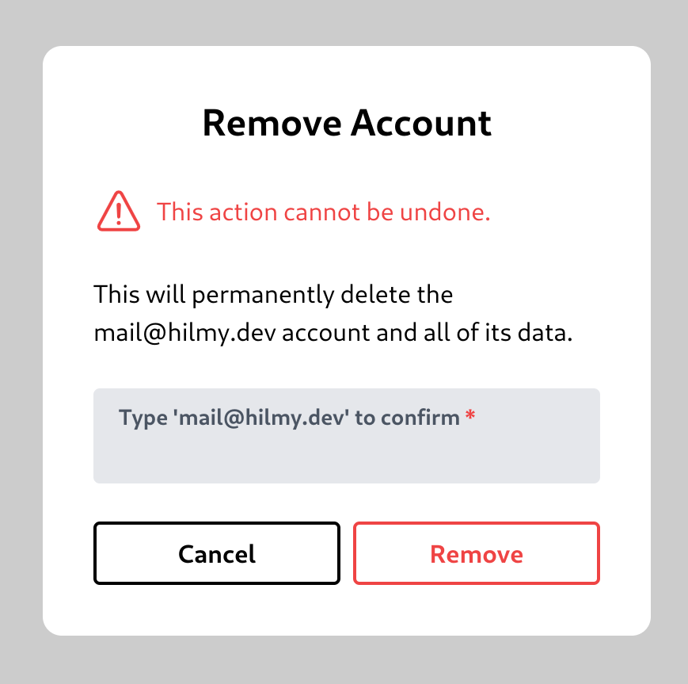

# Remove an Account

You can remove your account and data associated with your account by clicking your email in the top right corner. After that, click on 'Remove account' button.\
\
This will bring up the Remove Account modal.\
